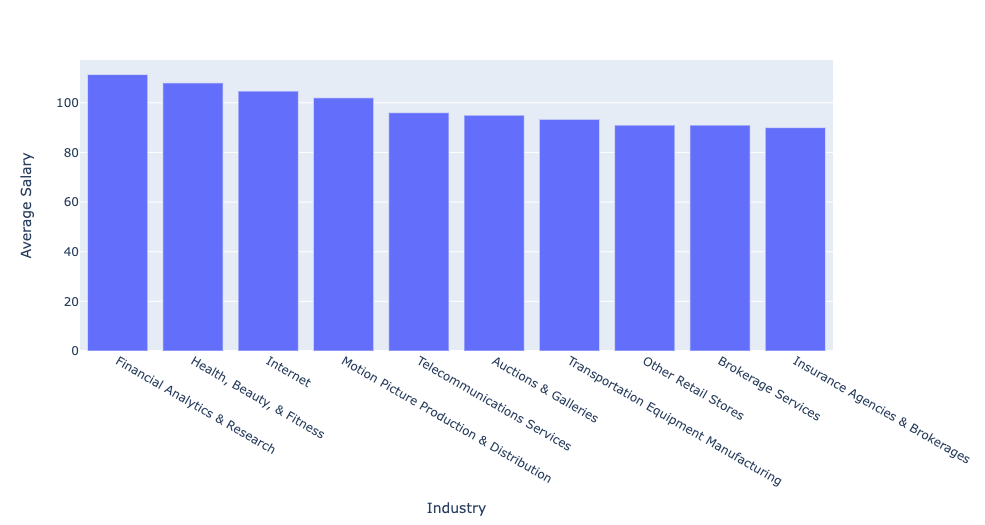
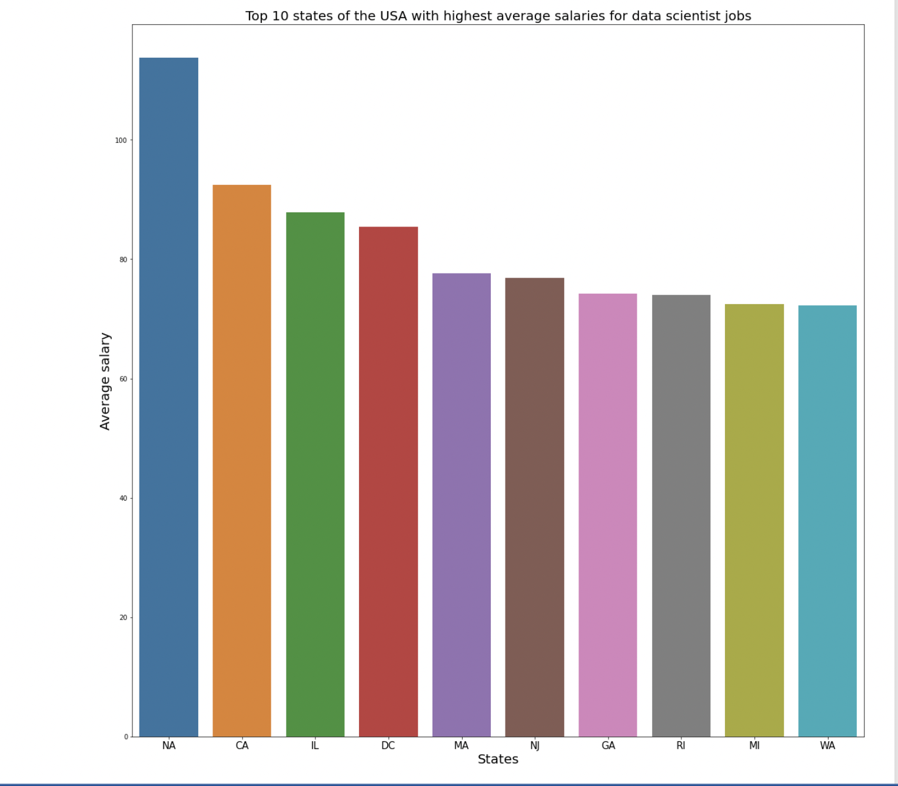
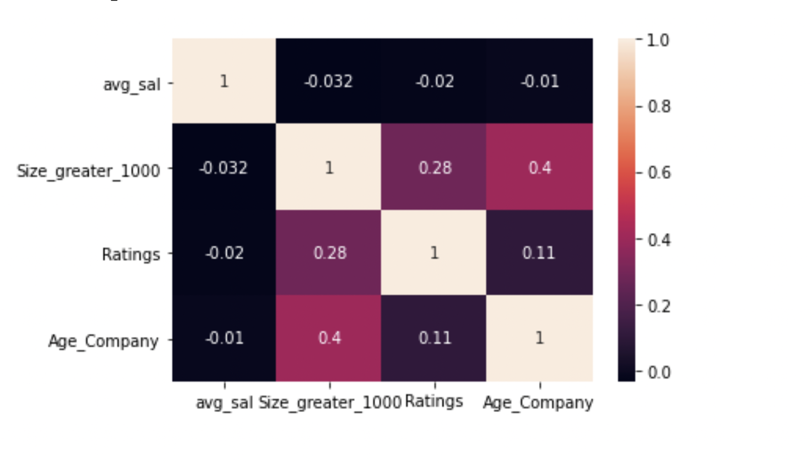

# Data-Scientist-Salary-Prediction Project overview:

* Developed a model that estimates data scientist salaries to help data scientists negotiate their income when they get a job.
* Scraped over 1000 job postings on glassdoor using selenium and python.
* Performed rigorous data cleaning and exploration to make the dataset fit for statistical modeling.
* Optimized multiple linear regression, Lasso, Ridge and random forest regression models to find out the best fit.

# Code and Resources used:

* **Python version:** 3.8.8
* **Packages:** pandas, numpy, matplotlib, seaborn, plotly, sklearn, statsmodels
* **Video tutorial:** https://www.youtube.com/watch?v=MpF9HENQjDo&list=PL2zq7klxX5ASFejJj80ob9ZAnBHdz5O1t&ab_channel=KenJee

# Web scraping:

Built a web scraper to collect over 1000 jobs from glassdoors. For each job, following parameters were collected:
  * Job Title
  * Salary Estimate
  * Company Name
  * Location
  * Size
  * Founded
  * Type of ownership
  * Industry
  * Sector
  * Revenue
 
 # Data Cleaning:
 
 The data scraped from website had to be cleaned before it could be used for further explorations and analysis. Following changes were made to the variables:
  * Null values handling -  Job postings without any mention of salary were removed from the dataset.
  * Parsed salary column into minimum salary, maximum salary and average salary. Average salary was then used as the independent variable for predictions.
  * Made new columns separating the company name text and its rating.
  * Created columns for remote jobs and separated state and city of the job posting.
  * Created a column for calculating the age of the company.
  * Grouped size of employees of the company.
  * Transformed founded date into age of company.
  * Created a column for simplified job title.
 
 # Exploratory Data Analysis:
 
 Below are a few highlights of the visualizations developed through the cleaned dataset.
 
 
 
 
 
 
 

 
 
 
 
 

# Model Building:

Firstly, the categorical variables were transformed into dummy variables. The dataset was split into train and test data sets with a test size of 20%. 5 different models were tried on the dataset and evaluated using Mean Absolute Error.

# Model Performance:

Random Forest regression model outperformed other models on test and validation states.

* **Multiple linear regression:** MAE: 21.62 
* **Lasso regression:** MAE: 21.29
* **Ridge regression:** MAE: 21.18
* **Decision trees regression:** MAE: 20.16
* **Random forest regression:** MAE: 15.1

